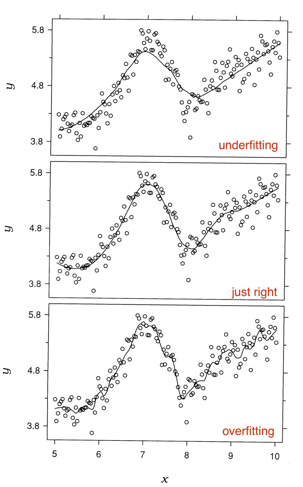

# Time Series


```{r setup, include = FALSE}
knitr::opts_chunk$set(echo = TRUE, warning = FALSE,
                      message = FALSE, cache = FALSE)
```


Chapter 11

Lines for time series, w/ time on the x-axis

# Multiple time series
```{r mortgagepres}
# data from: April 18, 2017
library(tidyverse)
df <- read_csv("mortgage.csv")
df <- df %>% gather(key = TYPE, value = RATE, -DATE) %>%
  mutate(TYPE = forcats::fct_reorder2(TYPE, DATE, RATE))# puts legend incorrect order


g <- ggplot(df, aes(DATE, RATE, color = TYPE)) + geom_line() +
  ggtitle("U.S. Mortgage Rates") +
  labs (x = "", y = "percent") +
  theme_grey(16) +
  theme(legend.title = element_blank())
g
```


# 
```{r mortgage}
ggplot(df, aes(DATE, RATE, fill = TYPE)) + geom_col() +
    ggtitle("U.S. Mortgage Rates", subtitle = "Not recommended!")
```

# Filter

```{r}
library(lubridate)
df2010 <- df %>% filter(year(DATE) == 2010)
ggplot(df2010, aes(DATE, RATE, color = TYPE)) + geom_line() +
    ggtitle("U.S. Mortgage Rates")
```

# Overall long-term trend (secular)

```{r}
dfman <- read_csv("ManchesterByTheSea.csv")
g <- ggplot(dfman, aes(Date, Gross)) + 
  geom_line() +
    ggtitle("Manchester by the Sea",
            "Daily Gross (US$), United States") +
  xlab("2016-2017")
g
```

# Loess smoother (non-parametric)

```{r loess}
g <- ggplot(dfman, aes(Date, Gross)) + geom_point()
g + geom_line(color = "grey50") +geom_smooth(method = "loess", se = FALSE, lwd =1.5) + ggtitle("Loess smoother")
```

# Under / overfitting




# Default smoothing parameter  .75

```{r}
g + geom_smooth(method = "loess", span = .75, se = FALSE)
```

# Change smoothing parameter  .1

```{r}
g + geom_smooth(method = "loess", span = .1, se = FALSE)
```

# Change smoothing parameter  .5

```{r}
g + geom_smooth(method = "loess", span = .5, se = FALSE)
```


# Change smoothing parameter  .9

```{r}
g + geom_smooth(method = "loess", span = .9, se = FALSE)
```

#
```{r, echo=FALSE}
# with weekly summary
weekly <- dfman %>%
    group_by(Year = year(Date),
             Week = week(Date)) %>%
    summarize(AvgWeeklyGross = mean(Gross)) %>%
    mutate(Date = as.Date("2015-12-27") +
               365*(Year - 2016) +
               7*(Week -1))
```


```{r, echo=FALSE}
ggplot(dfman, aes(Date, Gross/1000000)) +
    geom_line(color = "grey30") +
    geom_line(data = weekly,
              aes(Date, AvgWeeklyGross/1000000),
              color = "blue", lwd = 1.5) +
    geom_smooth(color = "deeppink", lwd = 1.5,
                se = FALSE) +
    annotate("text", x = as.Date("2017-02-15"),
             y = 1.65, label = "average weekly gross",
             color = "blue", hjust = 0) +
    annotate("segment", x = as.Date("2017-02-01"),
             xend = as.Date("2017-02-12"), y = 1.65,
             yend = 1.65, color = "blue", lwd = 1.5) +
    annotate("text", x = as.Date("2017-02-15"),
             y = 1.5, label = "geom_smooth()",
             color = "deeppink", hjust = 0) +
    annotate("segment", x = as.Date("2017-02-01"),
             xend = as.Date("2017-02-12"), y = 1.5,
             yend = 1.5, color = "deeppink", lwd = 1.5) +
    scale_x_date(date_labels = "%b\n%Y") +
    ylab("Daily Box Office Gross \n (in millions US$)") +
    xlab("") +
    ggtitle("Manchester by the Sea",
            "Daily Gross, United States") +
    theme_bw(16)
```


# Cyclical trends

```{r}
ggplot(dfman, aes(Date, Gross)) + geom_line()
```

# Are there cyclical patterns?

```{r}
ggplot(dfman, aes(Date, Gross)) + geom_line() + geom_point()
```

#

```{r}
library(plotly)
p <- plot_ly(
    dfman, x = ~Date, y = ~Gross,
    type = 'scatter',
    mode = 'lines+markers',
    # Hover text:
    hoverinfo = 'text',
    text = ~paste(Day)
)
p
```

# Mark the pattern

```{r}
g <- ggplot(dfman, aes(Date, Gross)) + geom_line() +
    ggtitle("Manchester by the Sea",
            "Daily Gross, United States")
saturday <- dfman %>% filter(wday(Date) == 7)
g + geom_point(data = saturday, aes(Date, Gross),
               color = "deeppink")
```


# Facet to test (remove) cyclical pattern

```{r, fig.height = 6}
# facets
ggplot(dfman, aes(Date, Gross)) +
    geom_line() +
    facet_grid(wday(Date, label = TRUE)~.)
```

# Another view

```{r facetbyday}
ggplot(dfman, aes(Date, Gross)) +
    geom_line(color = "grey30") + geom_point(size = 1) +
    facet_grid(.~wday(Date, label = TRUE))
```

# With smoother

```{r facetbydaysmooth}
ggplot(dfman, aes(Date, Gross)) +
    geom_line(color = "grey30") + geom_point(size = 1) +
    facet_grid(.~wday(Date, label = TRUE)) +
    geom_smooth(se = FALSE)
```

# Air Passengers

```{r, echo = TRUE}
plot(AirPassengers)
```

# `monthplot()`
```{r, echo = TRUE}
monthplot(AirPassengers)
```


# What about the abnormalities?

## Label by day of week

```{r christmas}
christmas <- dfman %>%
    filter(Date >= as.Date("2016-12-20") &
               Date <= ("2017-01-03"))

ggplot(christmas, aes(Date, Gross)) +
    geom_label(aes(label = wday(Date, label = TRUE))) +
    geom_line(color = "cornflowerblue") + 
    scale_x_date(date_labels = "%b\n%d",
                 date_breaks = "1 day")
```

# Different pattern for Christmas Week

## Label by day of month

```{r christmas2}
ggplot(christmas, aes(Date, Gross/1000000)) +
    geom_line(color = "cornflowerblue", lwd = 1.1) + 
    geom_point(color = "cornflowerblue", size = 2) +
    geom_label(data = christmas, 
               aes(x = Date, y = Gross/1000000 + .06, 
                   label = day(Date))) +
    scale_x_date(date_labels = "%a",
                 date_breaks = "1 day") +
    ggtitle("Manchester by the Sea",
            "Chistmas Week Box Office Gross") +
    labs(x = "Dec 2016 - Jan 2017", 
         y = "Daily Gross (in millions $US)") +
    theme_grey(14)
```


# Highlight the abnormality

```{r}
# annotate Christmas Week
start <- as.Date("2016-12-24")
end <- as.Date("2017-01-02")
g + annotate("rect", xmin = start, xmax = end,
             ymin = -Inf, ymax = Inf, fill = "green",
             alpha = .2) +
    annotate("text", x = end + 2,
             y = 1500000, label = "Dec 24 - Jan 2",
             color = "green", hjust = 0) +
    theme_classic()

```

# Comparisons (multi-line plots)

```{r}
set.seed(5702)
tidydf <- data.frame(time = 1:6, y1 = round(rnorm(6, 10,5), 2), y2 = round(rnorm(6, 100, 50), 2)) %>% 
  gather(key, value, -time)
ggplot(tidydf, aes(time, value, col = key)) +
  geom_line()
```

# Scale the data (create an index)

Each value is divided by the first value for that group and multiplied by 100:

```{r}
tidydf
tidydf <- tidydf %>% group_by(key) %>% 
  
  mutate(index = round(100*value/value[1], 2)) %>% 
  ungroup()
tidydf

ggplot(tidydf, aes(time, index, col = key)) +
  geom_line()
```

# Discrete data
```{r inspection}
set.seed(5702)
day <- 1:31
number <- 10 * (day - 14)^2 + 2000 + rnorm(1:31, 0, 400)
df <- data.frame(day, number)
ggplot(df, aes(day, number)) +
  geom_line(color = "deeppink") +
  geom_point(color = "deeppink") +
  scale_x_continuous(breaks = 1:31) +
  scale_y_continuous(limits = c(0, 5000)) +
  ggtitle("Average Motor Vehicle Inspections per Day",
          subtitle = "(fake data)") +
  labs(x = "day of month", y="number of inspections") +
  theme(plot.title = element_text(size = 16))
```

# Better for individual values
```{r}
ggplot(df, aes(day, number)) +
  geom_col() +
  scale_x_continuous(breaks = 1:31) +
  ggtitle("Average Motor Vehicle Inspections per Day") +
  labs(x = "day of month", y="number of inspections") +
  theme(plot.title = element_text(size = 16))
```

# Gaps

```{r}
# read file
mydat <- read_csv("WA_Sales_Products_2012-14.csv") %>% 
  mutate(Revenue = Revenue/1000000)

# convert Quarter to a single numeric value Q
mydat$Q <- as.numeric(substr(mydat$Quarter, 2, 2))

# convert Q to end-of-quarter date
mydat$Date <- as.Date(paste0(mydat$Year, "-",
                             as.character(mydat$Q*3),
                             "-30"))

# Check that dates look ok
# unique(mydat$Date)
```


```{r}
Methoddata <- mydat %>% group_by(Date, `Order method type`) %>%
    summarize(Revenue = sum(Revenue))

g <- ggplot(Methoddata, aes(Date, Revenue,
                            color = `Order method type`)) +
    geom_line(aes(group = `Order method type`)) +
    scale_x_date(limits = c(as.Date("2012-02-01"), as.Date("2014-12-31")),
        date_breaks = "6 months", date_labels = "%b %Y") +
  ylab("Revenue in mil $")
g
```

# Add points to show the frequency of the data
```{r}
g + geom_point()
```

# Another example

```{r}
No2013 <- Methoddata %>% filter(year(Date) != 2013)
g <- ggplot(No2013, aes(Date, Revenue,
                            color = `Order method type`)) +
    geom_line(aes(group = `Order method type`)) +
    scale_x_date(limits = c(as.Date("2012-02-01"), as.Date("2014-12-31")),
        date_breaks = "6 months", date_labels = "%b %Y") +
  ylab("Revenue in mil $")
g
```

# Add points to show the frequency of the data

```{r}
g + geom_point()
```

# Another option: leave gaps

(set missing values to NA)

```{r}
Methoddata$Date[year(Methoddata$Date)==2013] <- NA
g <- ggplot(Methoddata, aes(Date, Revenue,
                            color = `Order method type`)) + 
    geom_path(aes(group = `Order method type`)) +
    scale_x_date(limits = c(as.Date("2012-02-01"), as.Date("2014-12-31")),
        date_breaks = "6 months", date_labels = "%b %Y") +
  ylab("Revenue in mil $")
g
```


