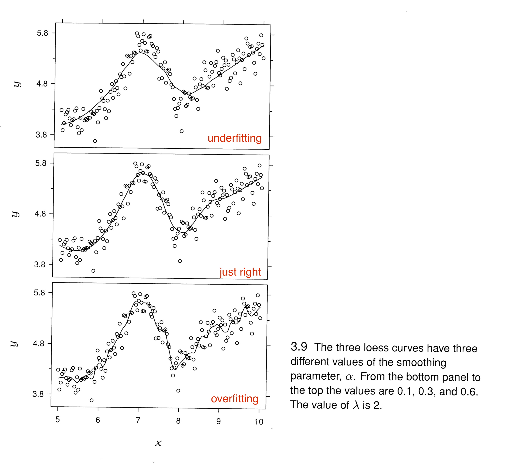

```{r setup, include=FALSE}
knitr::opts_chunk$set(echo = TRUE, warning = FALSE,
                      message = FALSE, cache = TRUE)
```

## Final Project

* Partners

* Suggested timeline:

by Tues, Nov 7 (one week): Finish cleaning data and come up with hypotheses about the data

by Tues, Nov 14 (two weeks): Create exploratory plots to answer those hypotheses/questions

by Tues, Nov 28 (four weeks): Write up findings and clean up graphs

by Tues, Dec 5 (five weeks): Project due

**Month of November: Come to TA office hours to get feedback on your work!**

**Write-as-you-go!!!**

## Getting coding help: how to write a good Stack Overflow question

https://www.r-bloggers.com/three-tips-for-posting-good-questions-to-r-help-and-stack-overflow/

https://gist.github.com/hadley/270442

https://stackoverflow.com/help/mcve

**Email me a draft of your question and I will help you edit it.**

*a friendlier forum for non-precise questions*

https://community.rstudio.com/

## Today

* Time series 

textbook, Chapter 11

* Working with time series in R

(`readr`) http://r4ds.had.co.nz/data-import.html

(`lubridate`) http://r4ds.had.co.nz/dates-and-times.html


## Please don't do this.
```{r mortgage}
# data from: April 18, 2017
# lines for time series data
library(tidyverse)
df <- read_csv("mortgage.csv")
df <- df %>% gather(key = TYPE, value = RATE, -DATE)
ggplot(df, aes(DATE, RATE, fill = TYPE)) + geom_col() +
    ggtitle("U.S. Mortgage Rates", subtitle = "Not recommended!")
```

## In general, use lines for time series
```{r}
ggplot(df, aes(DATE, RATE, color = TYPE)) + geom_line() +
    ggtitle("U.S. Mortgage Rates")
```

## Fix legend
```{r mortgagepres}
df$TYPE <- factor(df$TYPE,
                  levels = c("30 YR FIXED", "15 YR FIXED",
                             "5/1 ARM"))

g <- ggplot(df, aes(DATE, RATE, color = TYPE)) + geom_line() +
    ggtitle("U.S. Mortgage Rates") +
    labs (x = "", y = "percent") +
    theme_grey(16) +
    theme(legend.title = element_blank())
g
```

## 2010 only
```{r}
library(lubridate)
df2010 <- df %>% filter(year(DATE) == 2010)
ggplot(df2010, aes(DATE, RATE, color = TYPE)) + geom_line() +
    ggtitle("U.S. Mortgage Rates")
```

## Discrete data
```{r inspection}
set.seed(5702)
day <- 1:31
number <- 10 * (day - 14)^2 + 2000 + rnorm(1:31, 0, 400)
df <- data.frame(day, number)
ggplot(df, aes(day, number)) +
    geom_line(color = "deeppink") +
    geom_point(color = "deeppink") +
    scale_x_continuous(breaks = 1:31) +
    scale_y_continuous(limits = c(0, 5000)) +
    ggtitle("Average Motor Vehicle Inspections per Day",
            subtitle = "(fake data)") +
    labs(x = "day of month", y="number of inspections") +
    theme(plot.title = element_text(size = 16))
```

## Better for individual values
```{r}
ggplot(df, aes(day, number)) +
    geom_col() +
    scale_x_continuous(breaks = 1:31) +
    ggtitle("Average Motor Vehicle Inspections per Day") +
    labs(x = "day of month", y="number of inspections") +
    theme(plot.title = element_text(size = 16))
```


## Gross Sales: "Manchester By The Sea"

```{r}
dfman <- read_csv("ManchesterByTheSea.csv")
head(dfman)
```

## Gross Sales 
```{r}
g <- ggplot(dfman, aes(Date, Gross)) + 
  geom_line() +
    ggtitle("Manchester by the Sea",
            "Daily Gross, United States")
g
```


## + theme_halloween

```{r, echo = FALSE}
theme_halloween <- 
  theme(plot.background = element_rect(fill = "black"),
        panel.background = element_rect(fill = "black"),
        panel.grid.major = element_line(color = "orange"),
        panel.grid.minor = element_line(color = "grey70"),
        title = element_text(color = "orange"),
        axis.text = element_text(color = "white"))
```

```{r}
g + geom_line(color = "green") +
  geom_point(color = "green") + theme_halloween
```

## Day of week pattern?
```{r}
library(lubridate)
g + geom_point(aes(color = factor(wday(Date, label = TRUE))))
```

## Mark Saturdays
```{r saturday}
g <- ggplot(dfman, aes(Date, Gross)) + geom_line() +
    ggtitle("Manchester by the Sea",
            "Daily Gross, United States")
saturday <- dfman %>% filter(wday(Date) == 7)
g + geom_point(data = saturday, aes(Date, Gross),
               color = "deeppink")
```

##
```{r sat}
g + geom_text(data = saturday,
              aes(Date, Gross, label = "Sat"),
              color = "deeppink", size = 4)


```

##
```{r satpoint}
g + geom_point(size = 1) + 
    geom_text(data = saturday,
              aes(Date, Gross + 50000, label = "Sat"),
              color = "deeppink", size = 4) +
    geom_point(data = saturday, aes(Date, Gross),
               color = "deeppink", size = 1.5)
```


##
```{r, echo = FALSE, eval = FALSE}
# plotly (doesn't work, lines are grouped)
library(plotly)
g <- ggplot(dfman, aes(Date, Gross,
                    text = wday(Date, label = TRUE))) +
    geom_line() +
    geom_point(size = 1)
ggplotly(g, tooltip = c("text"))
```

```{r}
library(plotly)
# this works
dfman <-read_csv("ManchesterByTheSea.csv")
p <- plot_ly(
    dfman, x = ~Date, y = ~Gross,
    type = 'scatter',
    mode = 'lines+markers',
    # Hover text:
    hoverinfo = 'text',
    text = ~paste(Day)
)
p
```


## Trend
```{r}
g + geom_point(data = saturday, aes(Date, Gross),
               color = "deeppink") +
    geom_smooth(color = "blue", se = FALSE)
```

##




## loess
```{r loess}
g <- ggplot(dfman, aes(Date, Gross)) + geom_point()
g + geom_smooth(span = .15, se = FALSE)

```

##
```{r}
g + geom_smooth(span = .4, se = FALSE)
```


##
```{r}
g + geom_smooth(span = .6, se = FALSE)
```


##
```{r}
g + geom_smooth(span = .8, se = FALSE)
```


##
```{r}
g + geom_smooth(span = 1, se = FALSE)
```


## 
```{r}
g + geom_smooth(span = .05)
```


## 
```{r}
# lines grouped by color
ggplot(dfman, aes(Date, Gross)) +
    geom_smooth(color = "black") +
    geom_line(aes(color = wday(Date, label = TRUE)),
              lwd = 1) +
    geom_smooth(color = "black") +
    theme(legend.position = "bottom",
          legend.title = element_blank())
```

##
```{r, eval = FALSE, echo = FALSE}
# facets
ggplot(dfman, aes(Date, Gross)) +
    geom_line() +
    facet_wrap(~wday(Date, label = TRUE))
```

##
```{r facetbyday}
ggplot(dfman, aes(Date, Gross)) +
    geom_line(color = "grey30") + geom_point(size = 1) +
    facet_grid(.~wday(Date, label = TRUE))
```

##
```{r facetbydaysmooth}
ggplot(dfman, aes(Date, Gross)) +
    geom_line(color = "grey30") + geom_point(size = 1) +
    facet_grid(.~wday(Date, label = TRUE)) +
    geom_smooth(se = FALSE)
```


## Christmas Week  

```{r christmas}
christmas <- dfman %>%
    filter(Date >= as.Date("2016-12-20") &
               Date <= ("2017-01-03"))

ggplot(christmas, aes(Date, Gross)) +
    geom_label(aes(label = wday(Date, label = TRUE))) +
    geom_line(color = "cornflowerblue") + 
    scale_x_date(date_labels = "%b\n%d",
                 date_breaks = "1 day") +
    ggtitle("Chistmas Week")
```

##
```{r christmas2}
ggplot(christmas, aes(Date, Gross/1000000)) +
    geom_line(color = "cornflowerblue", lwd = 1.1) + 
    geom_point(color = "cornflowerblue", size = 2) +
    geom_label(data = christmas, 
               aes(x = Date, y = Gross/1000000 + .06, 
                   label = day(Date))) +
    scale_x_date(date_labels = "%a",
                 date_breaks = "1 day") +
    ggtitle("Manchester by the Sea",
            "Chistmas Week Box Office Gross") +
    labs(x = "Dec 2016 - Jan 2017", 
         y = "Daily Gross (in millions $US)") +
    theme_grey(14)
```


##
```{r}
# annotate Christmas Week
start <- as.Date("2016-12-24")
end <- as.Date("2017-01-02")
g + annotate("rect", xmin = start, xmax = end,
             ymin = -Inf, ymax = Inf, fill = "green",
             alpha = .2) +
    annotate("text", x = end + 2,
             y = 1500000, label = "Dec 24 - Jan 2",
             color = "green", hjust = 0) +
    theme_classic()

```

##
```{r}
# with weekly summary
weekly <- dfman %>%
    group_by(Year = year(Date),
             Week = week(Date)) %>%
    summarize(AvgWeeklyGross = mean(Gross)) %>%
    mutate(Date = as.Date("2015-12-27") +
               365*(Year - 2016) +
               7*(Week -1))
```


##
```{r}
# first attempt
ggplot(dfman, aes(Date, Gross)) +
    geom_line() +
    geom_line(data = weekly,
              aes(Date, AvgWeeklyGross),
              color = "blue") +
    geom_smooth(color = "deeppink")
```

##
```{r}
# cleaned up
ggplot(dfman, aes(Date, Gross/1000000)) +
    geom_line(color = "grey30") +
    geom_line(data = weekly,
              aes(Date, AvgWeeklyGross/1000000),
              color = "blue", lwd = 1.5) +
    geom_smooth(color = "deeppink", lwd = 1.5,
                se = FALSE) +
    annotate("text", x = as.Date("2017-02-15"),
             y = 1.65, label = "average weekly gross",
             color = "blue", hjust = 0) +
    annotate("segment", x = as.Date("2017-02-01"),
             xend = as.Date("2017-02-12"), y = 1.65,
             yend = 1.65, color = "blue", lwd = 1.5) +
    annotate("text", x = as.Date("2017-02-15"),
             y = 1.5, label = "geom_smooth()",
             color = "deeppink", hjust = 0) +
    annotate("segment", x = as.Date("2017-02-01"),
             xend = as.Date("2017-02-12"), y = 1.5,
             yend = 1.5, color = "deeppink", lwd = 1.5) +
    scale_x_date(date_labels = "%b\n%Y") +
    ylab("Daily Box Office Gross \n (in millions US$)") +
    xlab("") +
    ggtitle("Manchester by the Sea",
            "Daily Gross, United States") +
    theme_bw(16)
```

##
```{r}
# weekends
weekends <- dfman %>%
    mutate(daytype = ifelse(wday(Date) %in% c(6, 7, 1),
                            "Fri-Sun", "Mon-Thurs"))
g <- ggplot(weekends, aes(Date, Gross)) +
    geom_line(aes(color = daytype)) +
    theme(legend.title = element_blank())

g
```


##
```{r, eval = FALSE, echo = FALSE}
dfman <- dfman %>% select(Date, Gross) %>% 
    mutate(Month = month(Date, label = TRUE),
           DayofMonth = day(Date))
g <- ggplot(dfman, aes(DayofMonth, Gross, color = Month)) +
    geom_line() +
    scale_x_continuous(breaks = 1:31) +
    ggtitle("Manchester by the Sea",
            "Daily Gross, United States")
g
```


