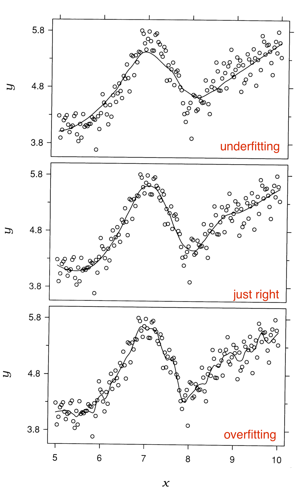

## Time Series
<hr>

Lines for time series, w/ time on the x-axis

## Multiple time series
<hr>

```{r mortgagepres}
# data from: https://www.freddiemac.com/pmms/docs/historicalweeklydata.xls
library(tidyverse)
df <- read_csv("historicalmortgage.csv")
df <- df |> 
  pivot_longer(cols = -DATE, names_to = "TYPE", values_to = "RATE") |> 
  mutate(TYPE = forcats::fct_reorder2(TYPE, DATE, RATE)) # puts legend in correct order

ggplot(df, aes(DATE, RATE, color = TYPE)) +
  geom_line() +
  labs(title = "U.S. Mortgage Rates", x = "", y = "percent") +
  theme_grey(16) +
  theme(legend.title = element_blank())
```


## No. 😭
<hr>

```{r mortgage}
ggplot(df, aes(DATE, RATE, fill = TYPE)) +
  geom_col() +
  labs(title = "U.S. Mortgage Rates")
```

## Filter
<hr>

```{r}
library(lubridate)
df2020 <- df |>
  filter(year(DATE) == 2020)
ggplot(df2020, aes(DATE, RATE, color = TYPE)) +
  geom_line() +
  labs(title = "U.S. Mortgage Rates")
```

## Overall long-term trend (secular)
<hr>

```{r}
dfman <- read_csv("ManchesterByTheSea.csv")
g <- ggplot(dfman, aes(Date, Gross)) +
  geom_line() +
  labs(title = "Manchester by the Sea", subtitle = "Daily Gross (US$), United States", x = "2016-2017")
g
```

## Loess smoother (non-parametric)
<hr>

```{r loess}
dfman$Group <- round(1:nrow(dfman)/(nrow(dfman)/5))
g <- ggplot(dfman, aes(Date, Gross)) +
  geom_point()
g +
  geom_line(color = "grey50") +
  geom_smooth(method = "loess", se = FALSE, lwd =1.5) +
  labs(title = "Loess smoother")
```

## Loess smoother (conceptual idea)
<hr>

```{r}
g +
  geom_line(color = "grey50") +
  geom_smooth(aes(group = Group), method = 'lm', color = "red", se = FALSE) + 
  geom_smooth(color = "blue", se = FALSE)
```

## Under / overfitting
<hr>




## Default smoothing parameter  .75
<hr>

```{r}
#| echo: true
g + geom_smooth(method = "loess", se = FALSE)
```

## Change smoothing parameter  .1
<hr>

```{r}
#| echo: true
g + geom_smooth(method = "loess", span = .1, se = FALSE)
```

## Change smoothing parameter  .5
<hr>

```{r}
#| echo: true
g + geom_smooth(method = "loess", span = .5, se = FALSE)
```


## Change smoothing parameter  .9
<hr>

```{r}
#| echo: true
g + geom_smooth(method = "loess", span = .9, se = FALSE)
```

##

```{r, echo=FALSE}
# with weekly summary
weekly <- dfman |>
    group_by(Year = year(Date),
             Week = week(Date)) |>
    summarize(AvgWeeklyGross = mean(Gross)) |>
    mutate(Date = as.Date("2015-12-27") +
               365*(Year - 2016) +
               7*(Week -1))
```


```{r, echo=FALSE}
ggplot(dfman, aes(Date, Gross/1000000)) +
    geom_line(color = "grey30") +
    geom_line(data = weekly,
              aes(Date, AvgWeeklyGross/1000000),
              color = "blue", lwd = 1.5) +
    geom_smooth(color = "deeppink", lwd = 1.5,
                se = FALSE) +
    annotate("text", x = as.Date("2017-02-15"),
             y = 1.65, label = "average weekly gross",
             color = "blue", hjust = 0) +
    annotate("segment", x = as.Date("2017-02-01"),
             xend = as.Date("2017-02-12"), y = 1.65,
             yend = 1.65, color = "blue", lwd = 1.5) +
    annotate("text", x = as.Date("2017-02-15"),
             y = 1.5, label = "geom_smooth()",
             color = "deeppink", hjust = 0) +
    annotate("segment", x = as.Date("2017-02-01"),
             xend = as.Date("2017-02-12"), y = 1.5,
             yend = 1.5, color = "deeppink", lwd = 1.5) +
    scale_x_date(date_labels = "%b\n%Y") +
    labs(title = "Manchester by the Sea",
         subtitle = "Daily Gross, United States", 
         x = NULL, 
         y = ("Daily Box Office Gross \n (in millions US$)")) +
    theme_bw(16)
```


## Cyclical trends
<hr>

```{r}
ggplot(dfman, aes(Date, Gross)) + geom_line()
```

## Are there cyclical patterns?
<hr>

```{r}
ggplot(dfman, aes(Date, Gross)) + geom_line() + geom_point()
```

##

```{r}
library(plotly)
p <- plot_ly(
    dfman, x = ~Date, y = ~Gross,
    type = 'scatter',
    mode = 'lines+markers',
    # Hover text:
    hoverinfo = 'text',
    text = ~paste(Day)
)
p
```

## Mark the pattern
<hr>

```{r}
g <- ggplot(dfman, aes(Date, Gross)) + geom_line() +
    labs(title = "Manchester by the Sea",
         subtitle = "Daily Gross, United States")
saturday <- dfman |> filter(wday(Date) == 7)
g + geom_point(data = saturday, aes(Date, Gross),
               color = "deeppink")
```


## Facet to test (remove) cyclical pattern
<hr>

```{r, fig.height = 6}
# facets
ggplot(dfman, aes(Date, Gross)) +
    geom_line() +
    facet_grid(wday(Date, label = TRUE)~.)
```

## Another view
<hr>

```{r facetbyday}
ggplot(dfman, aes(Date, Gross)) +
    geom_line(color = "grey30") + geom_point(size = 1) +
    facet_grid(.~wday(Date, label = TRUE))
```

## With smoother
<hr>

```{r facetbydaysmooth}
ggplot(dfman, aes(Date, Gross)) +
    geom_line(color = "grey30") + geom_point(size = 1) +
    facet_grid(.~wday(Date, label = TRUE)) +
    geom_smooth(se = FALSE)
```

## What about the abnormalities?
<hr>

Label by day of week

```{r christmas}
christmas <- dfman |>
    filter(Date >= as.Date("2016-12-20") &
               Date <= ("2017-01-03"))

ggplot(christmas, aes(Date, Gross)) +
    geom_label(aes(label = wday(Date, label = TRUE))) +
    geom_line(color = "cornflowerblue") + 
    scale_x_date(date_labels = "%b\n%d",
                 date_breaks = "1 day")
```

## Different pattern for Christmas Week
<hr>

Label by day of month

```{r christmas2}
ggplot(christmas, aes(Date, Gross/1000000)) +
    geom_line(color = "cornflowerblue", lwd = 1.1) + 
    geom_point(color = "cornflowerblue", size = 2) +
    geom_label(data = christmas, 
               aes(x = Date, y = Gross/1000000 + .06, 
                   label = day(Date))) +
    scale_x_date(date_labels = "%a",
                 date_breaks = "1 day") +
    labs(title = "Manchester by the Sea", 
         subtitle = "Christmas Week Box Office Gross",
         x = "Dec 2016 - Jan 2017", 
         y = "Daily Gross (in millions $US)") +
    theme_grey(14)
```


## Highlight the abnormality
<hr>

```{r}
# annotate Christmas Week
start <- as.Date("2016-12-24")
end <- as.Date("2017-01-02")
g + annotate("rect", xmin = start, xmax = end,
             ymin = -Inf, ymax = Inf, fill = "green",
             alpha = .2) +
    annotate("text", x = end + 2,
             y = 1500000, label = "Dec 24 - Jan 2",
             color = "green", hjust = 0) +
    theme_classic()

```

## Comparisons (multi-line plots)
<hr>

```{r}
set.seed(5702)
tidydf <- data.frame(time = 1:6, y1 = round(rnorm(6, 100, 50), 2),
           y2 = round(rnorm(6, 10, 5), 2)) |> 
  pivot_longer(cols = -time)
ggplot(tidydf, aes(time, value, col = name)) +
  geom_line()
```

## Scale the data (create an index)
<hr>

In each group divide by first value, mult by 100


```{r}
#| layout-ncol: 2
#| echo: true
head(tidydf, 8)
tidydf_scaled <- tidydf |> group_by(name) |>
  mutate(index = round(100*value/value[1], 2)) |> 
  ungroup()
head(tidydf_scaled, 8)
```


## Comparisons (multi-line plots)
<hr>

```{r}
#| layout-ncol: 2
ggplot(tidydf, aes(time, value, col = name)) +
  geom_line() +
  labs(title = "Original data") +
  theme_grey(18)

ggplot(tidydf_scaled, aes(time, index, col = name)) +
  geom_line() +
  labs(title = "Scaled data") +
  theme_grey(18)
```

## Discrete data
<hr>

```{r inspection}
set.seed(5702)
day <- 1:31
number <- 10 * (day - 14)^2 + 2000 + rnorm(1:31, 0, 400)
df <- data.frame(day, number)
ggplot(df, aes(day, number)) +
  geom_line(color = "deeppink") +
  geom_point(color = "deeppink") +
  scale_x_continuous(breaks = 1:31) +
  scale_y_continuous(limits = c(0, 5000)) +
  labs(title = "Average Motor Vehicle Inspections per Day",
          subtitle = "(fake data)",
       x = "day of month", y = "number of inspections") +
  theme(plot.title = element_text(size = 16))
```

## Better for individual values
<hr>

```{r}
ggplot(df, aes(day, number)) +
  geom_col() +
  scale_x_continuous(breaks = 1:31) +
  labs(title = "Average Motor Vehicle Inspections per Day",
       x = "day of month", y = "number of inspections") +
  theme(plot.title = element_text(size = 16))
```

## Gaps
<hr>

```{r}
# read file
mydat <- read_csv("WA_Sales_Products_2012-14.csv") |> 
  mutate(Revenue = Revenue/1000000)

# convert Quarter to a single numeric value Q
mydat$Q <- as.numeric(substr(mydat$Quarter, 2, 2))

# convert Q to end-of-quarter date
mydat$Date <- as.Date(paste0(mydat$Year, "-",
                             as.character(mydat$Q*3),
                             "-30"))

# Check that dates look ok
# unique(mydat$Date)
```


```{r}
Methoddata <- mydat |> group_by(Date, `Order method type`) |>
    summarize(Revenue = sum(Revenue))

g <- ggplot(Methoddata, aes(Date, Revenue,
                            color = `Order method type`)) +
    geom_line(aes(group = `Order method type`)) +
    scale_x_date(limits = c(as.Date("2012-02-01"), as.Date("2014-12-31")),
        date_breaks = "6 months", date_labels = "%b %Y") +
  ylab("Revenue in mil $")
g
```

## Add points to show the frequency of the data
<hr>

```{r}
g + geom_point()
```

## Another example
<hr>

```{r}
No2013 <- Methoddata |> filter(year(Date) != 2013)
g <- ggplot(No2013, aes(Date, Revenue,
                            color = `Order method type`)) +
    geom_line(aes(group = `Order method type`)) +
    scale_x_date(limits = c(as.Date("2012-02-01"), as.Date("2014-12-31")),
        date_breaks = "6 months", date_labels = "%b %Y") +
  ylab("Revenue in mil $")
g
```

## Add points to show the frequency of the data
<hr>

```{r}
g + geom_point()
```

## Another option: leave gaps
<hr>

(set missing values to NA)

```{r}
Methoddata$Date[year(Methoddata$Date)==2013] <- NA
g <- ggplot(Methoddata, aes(Date, Revenue,
                            color = `Order method type`)) + 
    geom_path(aes(group = `Order method type`)) +
    scale_x_date(limits = c(as.Date("2012-02-01"), as.Date("2014-12-31")),
        date_breaks = "6 months", date_labels = "%b %Y") +
  ylab("Revenue in mil $")
g
```


